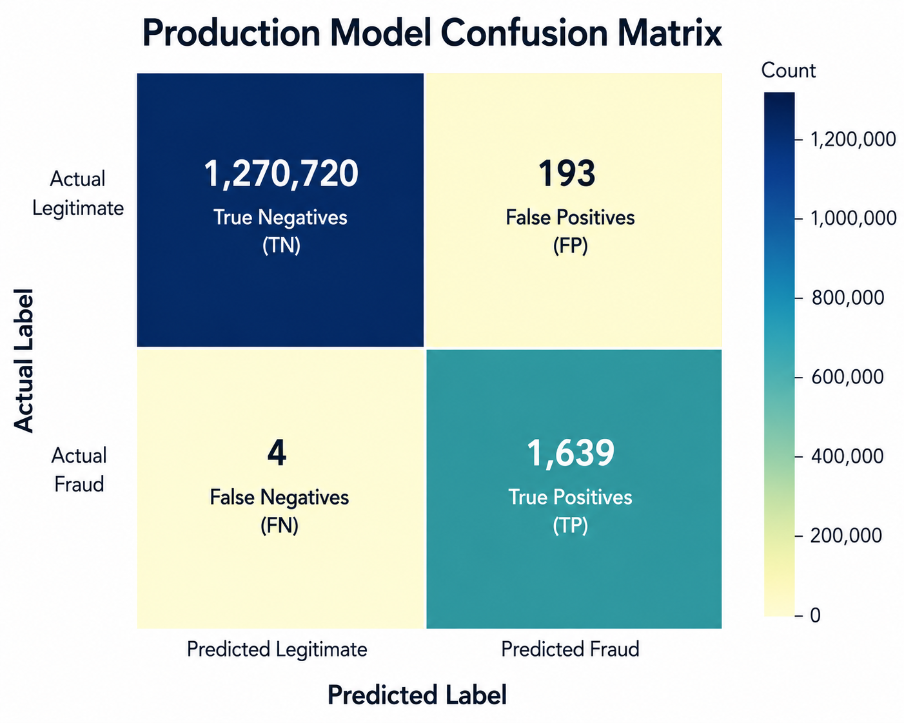

# Model Evaluation

Selecting the best model required more than comparing accuracy. Since fraudulent transactions represent only a small fraction of the dataset, the evaluation focused on **precision**, **recall**, and **F1-score**, which provide a more reliable assessment of fraud detection performance than accuracy alone.

The final production model, **CatBoost**, achieved a **precision of 0.9106**, **recall of 0.9976**, and an **F1-score of 0.9521**. These results indicate that the model successfully identified nearly all fraudulent transactions while maintaining a low false-positive rate. During evaluation, it correctly detected **1,639 of the 1,643 fraudulent transactions**, missing only **four** cases.

*Figure 6. Confusion matrix of the deployed CatBoost production model. The model correctly classified the overwhelming majority of legitimate transactions while detecting nearly all fraudulent transactions, resulting in only four false negatives and 193 false positives.*

Earlier experiments compared Balanced Random Forest, XGBoost, and CatBoost using SMOTE to address the severe class imbalance. Although SMOTE improved experimental performance, it introduced additional memory overhead during training. For the production pipeline, CatBoost's built-in auto_class_weights="Balanced" was selected because it handled class imbalance without synthetic oversampling, resulting in a simpler and more memory-efficient deployment while maintaining strong predictive performance.

These results demonstrate that the selected model provides a practical balance between accuracy, reliability, and deployment readiness, making it well suited for real-time financial fraud detection.
