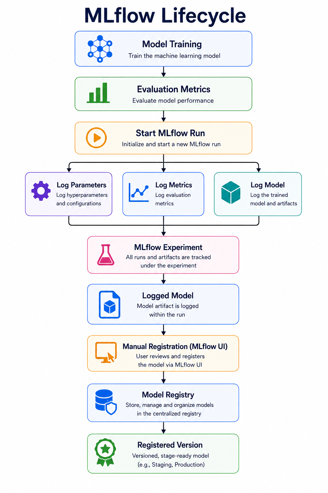

# Deployment

Developing an accurate fraud detection model was only part of the project. To demonstrate how machine learning systems operate in production, the final model was deployed as a RESTful API using FastAPI. Swagger UI was used to provide interactive documentation and simplify testing of the prediction endpoints while maintaining reproducibility and long-term maintainability.

Incoming transaction requests are first validated using Pydantic before undergoing the same preprocessing and feature engineering steps applied during training. The processed transaction is then evaluated by the production CatBoost model, which was configured with auto_class_weights="Balanced" to efficiently address class imbalance without requiring oversampled training data during deployment. Based on the predicted fraud probability, the API returns an appropriate decision while recording the transaction and prediction outcome for future analysis.

To support reproducibility and model monitoring, **MLflow** was integrated into the training pipeline to track model parameters, evaluation metrics, and generated artifacts across experiments. The selected production model was registered and versioned within MLflow before deployment. A Streamlit dashboard was developed to visualize experiment results and monitor data drift, providing a simple interface for inspecting model performance and identifying changes in incoming transaction data over time.

Beyond deployment, the platform incorporates data drift detection to monitor whether incoming transaction data continues to follow the statistical characteristics of the training dataset. Detecting distributional changes provides an early indication that model performance may degrade over time and that retraining could be required.

Together, automated deployment, experiment tracking, and continuous monitoring transform the project from a standalone machine learning model into a production-oriented fraud detection platform that follows modern MLOps practices.

*Figure 7. End-to-end machine learning lifecycle illustrating experiment tracking with MLflow, model registration, production deployment through FastAPI, and continuous monitoring using data drift detection to support reliable long-term operation.*