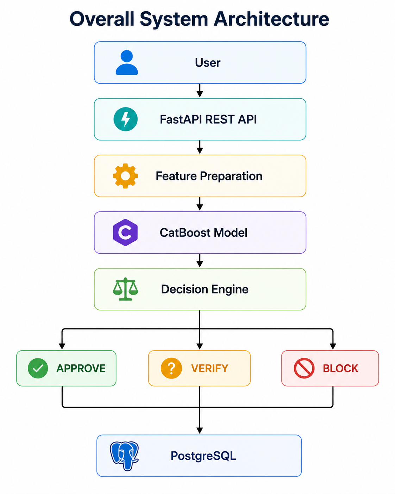
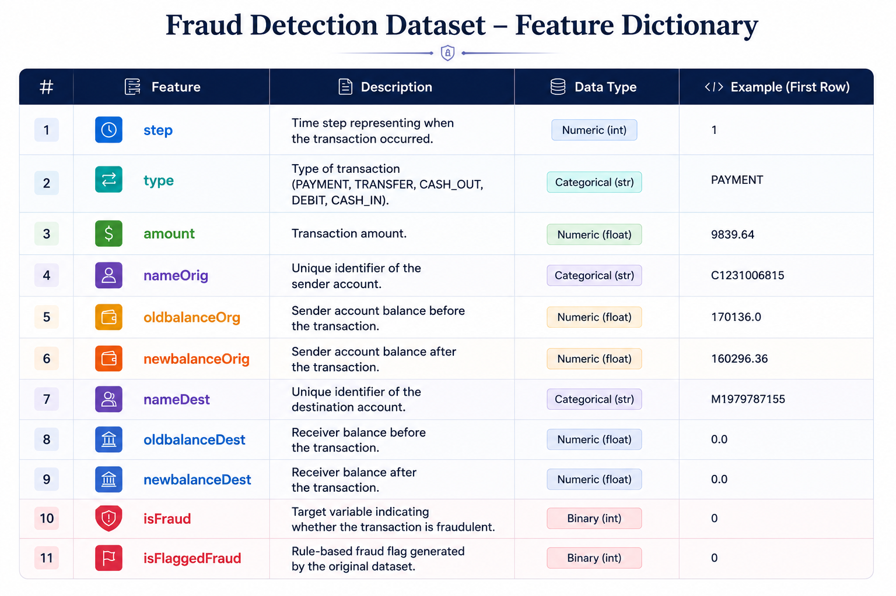
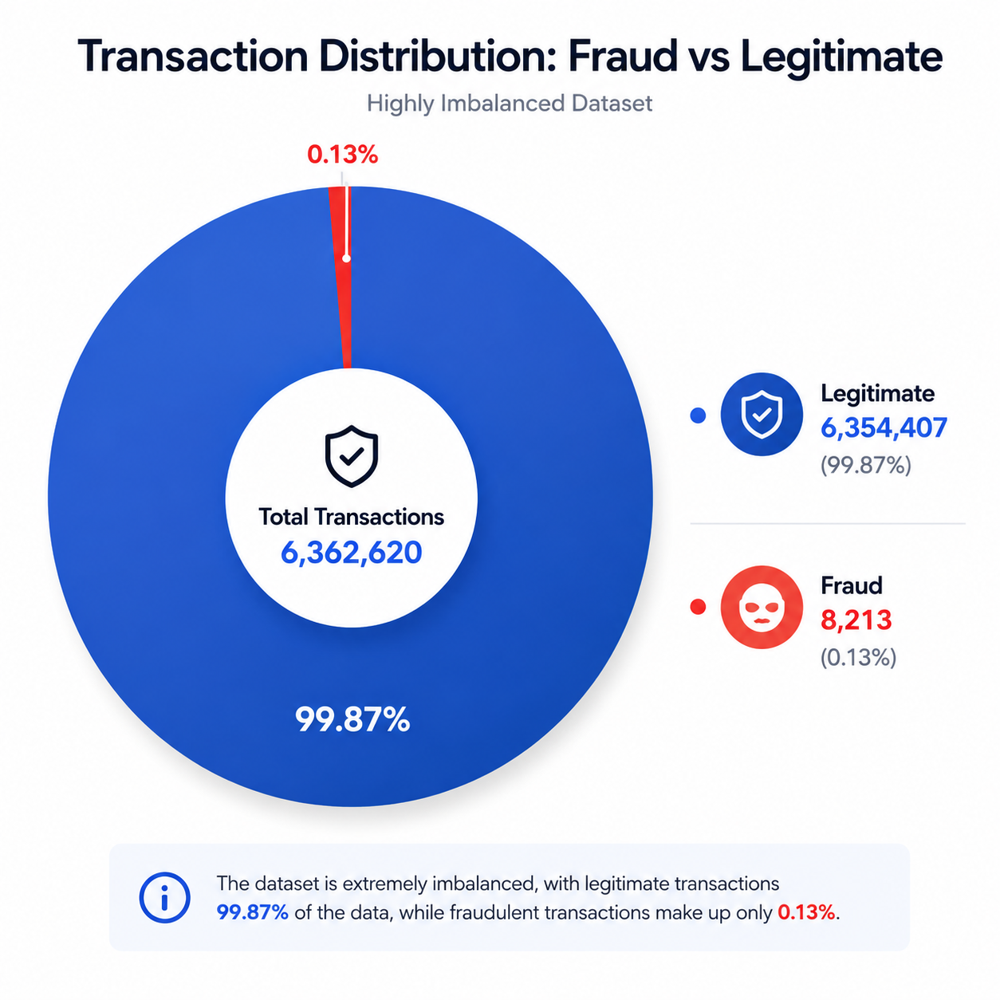
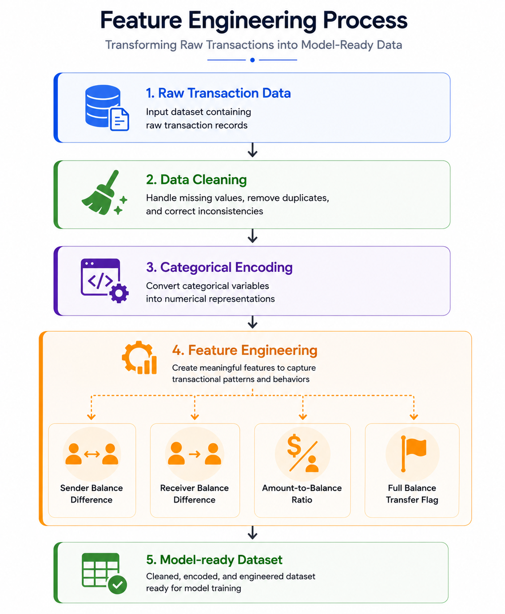
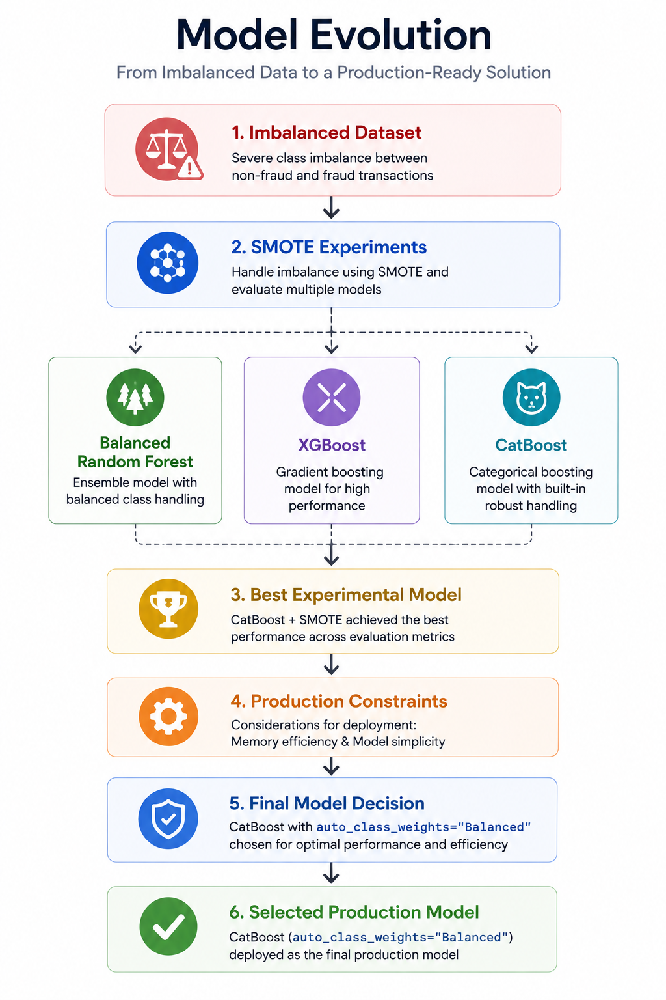

# From an Online Scam to Building an End-to-End Financial Fraud Detection Pipeline

> A practical walkthrough of designing, evaluating, and deploying a production-ready fraud detection system.

**Author:** Gokul Kalyan

---

# Introduction

A few months ago, I came across an online store advertising premium shirts at an unbelievably low price. The website looked convincing, the offer seemed genuine, and I completed the purchase without giving it much thought. Days passed with no order confirmation, no shipment updates, and eventually, I realized I had fallen victim to an online shopping scam.

What stayed with me was not the money I lost, but the curiosity the experience sparked: **How do financial systems identify and stop fraudulent transactions?** That curiosity became the starting point of this project.

That question led me down a path I hadn't expected. I began exploring how banks and payment platforms detect fraudulent transactions, the challenges they face, and the role machine learning plays in identifying suspicious patterns hidden within millions of legitimate transactions. The more I learned, the more I realized that building an effective fraud detection system involves far more than training a machine learning model.

Driven by that curiosity, I decided to build an end-to-end machine learning pipeline using a large-scale financial transaction dataset. The goal was not simply to achieve high predictive performance, but to understand every stage of the development process—from exploring the data and engineering meaningful features to comparing machine learning models, evaluating their performance, deploying the final solution with Streamlit, and documenting the project in a structured and reproducible manner.

This article documents that engineering journey. Rather than presenting only the final results, I will walk through the decisions, challenges, and lessons that shaped the project from start to finish. Whether you're a machine learning enthusiast, a student building your first end-to-end project, or an aspiring ML engineer looking to strengthen your portfolio, I hope this article provides practical insights into building a complete machine learning solution.

Let's begin by understanding the problem of financial transaction fraud and why it remains one of the most challenging applications of machine learning.

---

# Understanding Financial Transaction Fraud

The question that motivated this project naturally led to another: **What exactly makes financial transaction fraud such a difficult problem to solve?**

As digital payments have become an integral part of everyday life, financial institutions process millions of transactions every day. Among these legitimate transactions are a very small number of fraudulent ones. Although they represent only a tiny fraction of the total transaction volume, their financial impact can be significant for both organizations and customers. Detecting these rare events accurately and quickly has therefore become an important challenge.

At first glance, fraud detection might seem straightforward. One might assume that fraudulent transactions simply follow obvious patterns that can be identified using predefined rules. In practice, however, the problem is far more complex. Fraudsters continuously adapt their techniques, legitimate customer behavior varies widely, and the characteristics of fraudulent transactions often overlap with normal activity. As a result, distinguishing between genuine and fraudulent transactions is rarely a simple rule-based task.

Another challenge lies in the nature of the data itself. Fraud detection datasets are typically highly imbalanced, with legitimate transactions vastly outnumbering fraudulent ones. This imbalance creates a difficult learning environment for machine learning models. A model that predicts every transaction as legitimate may achieve high overall accuracy while completely failing to identify fraudulent activity. For this reason, evaluation metrics such as precision, recall, and F1-score become more meaningful than accuracy alone.

Machine learning offers a practical approach to this challenge by learning patterns from historical transaction data instead of relying entirely on manually defined rules. Rather than searching for a single characteristic that identifies fraud, machine learning models analyze combinations of transaction attributes to estimate the likelihood that a transaction is fraudulent. The effectiveness of these models, however, depends heavily on the quality of the available data and the engineering decisions made during development.

Understanding these challenges convinced me that building a fraud detection model involved much more than selecting an algorithm. It required understanding the data, exploring its characteristics, engineering meaningful features, and evaluating models using appropriate metrics. In other words, success depended on the entire machine learning pipeline rather than on model selection alone.

With this perspective in mind, the next step was to find a dataset that could realistically represent financial transaction behavior and support the development of an end-to-end machine learning project.

---

# Project Overview

After understanding the challenges of financial transaction fraud detection, the next objective was to build a solution that demonstrated the complete lifecycle of a machine learning project rather than focusing solely on model training.

The goal of this project was to develop an end-to-end fraud detection system capable of identifying potentially fraudulent financial transactions using supervised machine learning. Instead of treating the project as an isolated classification task, the emphasis was placed on designing a structured and reproducible workflow that reflects the stages commonly followed in real-world machine learning projects.

The project began with acquiring and understanding the dataset. Before selecting any machine learning algorithm, the data was carefully explored to understand its structure, feature distributions, class imbalance, and overall quality. This exploratory analysis provided valuable insights that guided subsequent preprocessing and feature engineering decisions.

Once the data was understood, the next stage involved preparing it for model development. Categorical variables were encoded, numerical features were standardized where appropriate, and the dataset was transformed into a format suitable for supervised learning. Since fraudulent transactions represent only a small fraction of the available records, particular attention was given to selecting evaluation metrics that accurately reflected model performance instead of relying solely on overall accuracy.

Several machine learning algorithms were then trained and compared to identify the model that provided the best balance between fraud detection capability and prediction reliability. Each model was evaluated using multiple performance metrics, enabling a comprehensive comparison rather than depending on a single score.

Beyond model development, the project also focused on deployment and usability.The final model was deployed as a **FastAPI** service, exposing prediction endpoints through Swagger UI for interactive testing. **Streamlit** was used separately to visualize MLflow experiment tracking and data drift monitoring.To improve reproducibility and maintainability, the project was organized using a structured repository with comprehensive documentation covering every stage of development.

The complete workflow followed throughout the project is illustrated below.

*Figure 1. Overall architecture of the end-to-end financial fraud detection system, illustrating the inference pipeline from API request to fraud decision and transaction logging.*

Rather than viewing these stages as independent tasks, they should be considered interconnected components of a single machine learning pipeline. Decisions made during data preparation influence feature engineering, feature engineering affects model performance, and model evaluation ultimately determines the suitability of the deployed solution.

The following chapter introduces the dataset that forms the foundation of this pipeline, examining its structure, characteristics, and the challenges it presents before any modeling begins.

---

# Understanding the Dataset

Every machine learning project begins with data, and the effectiveness of the final solution depends heavily on the quality and characteristics of that data. After identifying financial transaction fraud detection as the problem to solve, the next step was selecting a dataset that was sufficiently large, diverse, and representative to support the development of a complete machine learning pipeline.

This project uses the **Financial Fraud Detection Dataset** published on Kaggle by **Aman Ali Siddiqui**. The dataset contains **6,362,620 financial transactions** and is intended for developing and evaluating machine learning models for fraud detection in digital payment systems [1]. Its large scale makes it well suited for exploring the entire machine learning workflow, including data preprocessing, exploratory data analysis, feature engineering, model training, evaluation, and deployment.

## Dataset Structure

The dataset consists of eleven attributes describing different aspects of each transaction. Together, these features capture transaction metadata, account balances before and after the transaction, and the target labels used for fraud detection.

*Figure 2. Dataset features description showing the key attributes, their descriptions, data types, and representative values used in the financial fraud detection dataset.*

The **`isFraud`** column serves as the target variable for supervised learning, where a value of **1** represents a fraudulent transaction and **0** represents a legitimate transaction.

## Understanding the Problem Through the Data

One of the first observations from exploring the dataset is that fraudulent transactions represent only a very small proportion of all transactions. Most records correspond to legitimate financial activity, while fraudulent transactions form a minority class.

This imbalance introduces one of the most significant challenges in fraud detection. A model trained without considering the imbalance may achieve an excellent accuracy score simply by predicting every transaction as legitimate. Such a model would appear highly accurate while failing to identify the very transactions it is intended to detect.

*Figure 3. Distribution of legitimate and fraudulent transactions in the dataset. Fraudulent transactions account for only 0.13% of all transactions, highlighting the severe class imbalance that motivates the choice of evaluation metrics and modeling strategy.*

For this reason, evaluating fraud detection models requires metrics that go beyond overall accuracy. Precision, recall, and the F1-score provide a more meaningful assessment because they measure how effectively the model identifies fraudulent transactions while minimizing false alarms.

## Why This Dataset Was Chosen

Several factors made this dataset appropriate for the project.

First, its scale provides an opportunity to work with millions of transaction records, making the project more representative of real-world machine learning workflows than small demonstration datasets.

Second, the dataset contains multiple transaction types, allowing the analysis of different payment behaviors rather than focusing on a single transaction category.

Third, the available numerical features, categorical variables, and target labels provide sufficient information for performing exploratory data analysis, feature engineering, and supervised learning.

Finally, the dataset supports the primary objective of this project: building an end-to-end fraud detection pipeline rather than simply training a classification model.

## Limitations

Although the dataset provides a comprehensive collection of financial transaction records for experimentation, it also has limitations that should be acknowledged.

The dataset is anonymized, meaning account identifiers do not reveal any customer-specific information. This preserves privacy but also prevents incorporating demographic or behavioral context that may exist in production fraud detection systems.

Additionally, the dataset represents a predefined snapshot of transactions. Real-world fraud detection systems continuously receive new transactions, requiring models to adapt to changing fraud patterns over time. Consequently, the performance achieved in this project should be interpreted within the scope of the available dataset.

Recognizing these characteristics before model development is an important step in building reliable machine learning solutions. Rather than immediately training algorithms, it is essential to understand the data, identify potential issues, and discover patterns that may influence model performance.

The next chapter focuses on **Exploratory Data Analysis (EDA)**, where the dataset is examined in greater detail to uncover transaction distributions, class imbalance, feature relationships, and other insights that guide the subsequent stages of feature engineering and model development.

---

## References

**[1]** Aman Ali Siddiqui. *Financial Fraud Detection Dataset*. Kaggle. Available at: https://www.kaggle.com/datasets/amanalisiddiqui/fraud-detection-dataset

---

# Exploratory Data Analysis

Exploratory Data Analysis (EDA) was performed to better understand the dataset before developing machine learning models. The analysis focused on examining data quality, feature distributions, transaction characteristics, and the distribution of fraudulent and legitimate transactions.

The dataset contained **6,362,620 transaction records** across eleven features and showed no significant missing values, duplicates, allowing the analysis to proceed without extensive data cleaning. One of the most important findings was the severe class imbalance, where fraudulent transactions represented only a small fraction of the dataset. This highlighted the need to evaluate models using precision, recall, and F1-score rather than accuracy alone.

The analysis also revealed variations in transaction types and a right-skewed distribution of transaction amounts, providing valuable insights for feature engineering and model development. These observations established a strong understanding of the data and guided the preprocessing decisions discussed in the next chapter.

---

# Feature Engineering

After exploring the dataset, the next step was transforming the raw transaction data into features better suited for machine learning. Rather than relying solely on the original attributes, the preprocessing pipeline focused on preserving information that could improve the model's ability to distinguish between legitimate and fraudulent transactions.

Identifier columns that did not generalize to unseen customers were removed to prevent the model from learning account-specific patterns. Transaction categories were encoded into numerical values, and additional behavioural features were engineered using account balances and transaction amounts. These derived features captured characteristics such as balance changes, transaction-to-balance relationships, and unusually large transfers, providing richer information than the raw attributes alone.

*Figure 4. Feature engineering pipeline illustrating the transformation of raw transaction records into a model-ready dataset through data cleaning, categorical encoding, and the creation of engineered features that capture transaction behavior.*

The preprocessing pipeline was designed to be reusable, ensuring that identical feature transformations were applied during both model training and inference. This consistency helps prevent training-serving skew and supports reliable deployment of the final model.

With the data prepared, the next stage involved training and evaluating multiple machine learning models to identify the most effective approach for fraud detection.

---

# Model Development

With the data prepared, the next step was to train machine learning models capable of distinguishing legitimate transactions from fraudulent ones. Rather than selecting a single algorithm from the outset, multiple classification models were trained and evaluated to understand their strengths and limitations on the dataset.

The initial experiments included widely used supervised learning algorithms, providing a baseline for comparison. Each model was trained using the same preprocessing pipeline and evaluated under identical conditions to ensure a fair comparison.

Given the highly imbalanced nature of the dataset, overall accuracy was not considered a sufficient measure of performance. Instead, greater emphasis was placed on precision, recall, and the F1-score, as these metrics better reflect a model's ability to identify fraudulent transactions while minimizing false positives.

Among the evaluated models, **CatBoost** consistently delivered the strongest overall performance. Its ability to capture complex relationships within the engineered features, combined with efficient handling of structured tabular data, resulted in a better balance between fraud detection capability and prediction reliability.

The selected CatBoost model was then saved and integrated into the deployment pipeline, forming the core of the fraud detection system presented in this project.

*Figure 5. Evolution of the model development process, from addressing class imbalance with SMOTE during experimentation to selecting a production-ready CatBoost model using built-in balanced class weights for a simpler and more memory-efficient deployment pipeline.*

The following chapter evaluates the performance of the selected model in greater detail and compares its results against the alternative approaches considered during development.

---

# Model Evaluation

Selecting the best model required more than comparing accuracy. Since fraudulent transactions represent only a small fraction of the dataset, the evaluation focused on **precision**, **recall**, and **F1-score**, which provide a more reliable assessment of fraud detection performance than accuracy alone.

The final production model, **CatBoost**, achieved a **precision of 0.9106**, **recall of 0.9976**, and an **F1-score of 0.9521**. These results indicate that the model successfully identified nearly all fraudulent transactions while maintaining a low false-positive rate. During evaluation, it correctly detected **1,639 of the 1,643 fraudulent transactions**, missing only **four** cases.

*Figure 6. Confusion matrix of the deployed CatBoost production model. The model correctly classified the overwhelming majority of legitimate transactions while detecting nearly all fraudulent transactions, resulting in only four false negatives and 193 false positives.*

Earlier experiments compared Balanced Random Forest, XGBoost, and CatBoost using SMOTE to address the severe class imbalance. Although SMOTE improved experimental performance, it introduced additional memory overhead during training. For the production pipeline, CatBoost's built-in auto_class_weights="Balanced" was selected because it handled class imbalance without synthetic oversampling, resulting in a simpler and more memory-efficient deployment while maintaining strong predictive performance.

These results demonstrate that the selected model provides a practical balance between accuracy, reliability, and deployment readiness, making it well suited for real-time financial fraud detection.

---

# Deployment

Developing an accurate fraud detection model was only part of the project. To demonstrate how machine learning systems operate in production, the final model was deployed as a RESTful API using FastAPI. Swagger UI was used to provide interactive documentation and simplify testing of the prediction endpoints while maintaining reproducibility and long-term maintainability.

Incoming transaction requests are first validated using Pydantic before undergoing the same preprocessing and feature engineering steps applied during training. The processed transaction is then evaluated by the production CatBoost model, which was configured with auto_class_weights="Balanced" to efficiently address class imbalance without requiring oversampled training data during deployment. Based on the predicted fraud probability, the API returns an appropriate decision while recording the transaction and prediction outcome for future analysis.

To support reproducibility and model monitoring, **MLflow** was integrated into the training pipeline to track model parameters, evaluation metrics, and generated artifacts across experiments. The selected production model was registered and versioned within MLflow before deployment. A Streamlit dashboard was developed to visualize experiment results and monitor data drift, providing a simple interface for inspecting model performance and identifying changes in incoming transaction data over time.

Beyond deployment, the platform incorporates data drift detection to monitor whether incoming transaction data continues to follow the statistical characteristics of the training dataset. Detecting distributional changes provides an early indication that model performance may degrade over time and that retraining could be required.

Together, automated deployment, experiment tracking, and continuous monitoring transform the project from a standalone machine learning model into a production-oriented fraud detection platform that follows modern MLOps practices.

*Figure 7. End-to-end machine learning lifecycle illustrating experiment tracking with MLflow, model registration, production deployment through FastAPI, and continuous monitoring using data drift detection to support reliable long-term operation.*

---

# Lessons Learned

Building this project reinforced that successful machine learning systems depend on far more than selecting a high-performing algorithm. Throughout the development process, I found that understanding the data, designing meaningful features, and maintaining a consistent preprocessing pipeline had a greater impact on the final solution than model selection alone.

Another important lesson was the significance of evaluating models using metrics appropriate for the problem. In highly imbalanced datasets such as fraud detection, accuracy can be misleading. Focusing on precision, recall, and the F1-score provided a much clearer understanding of the model's ability to detect fraudulent transactions.

Finally, this project highlighted the importance of treating machine learning as an end-to-end engineering process. From data exploration and feature engineering to deployment and documentation, every stage contributed to building a solution that is reproducible, maintainable, and ready for practical use.

These experiences have provided a stronger understanding of how machine learning models transition from experimentation to production-ready systems.

---

# Conclusion

Financial fraud detection presents a challenging machine learning problem, requiring more than simply training a classification model. Through this project, I explored the complete lifecycle of developing a fraud detection system—from understanding the problem and analyzing the dataset to engineering meaningful features, evaluating multiple models, and deploying a production-oriented inference pipeline.

The results demonstrate that combining thoughtful feature engineering with an appropriate machine learning algorithm can produce a solution capable of accurately identifying fraudulent transactions while remaining practical for deployment. More importantly, the project reinforced that successful machine learning solutions are built through careful engineering decisions at every stage of the pipeline, not by model selection alone.

While there is still scope for future enhancements, such as incorporating real-time streaming data, adaptive learning, or advanced anomaly detection techniques, this project establishes a strong foundation for developing intelligent fraud detection systems.

The complete source code, documentation, and deployment resources are available in the project repository for readers interested in exploring the implementation in greater detail. I hope this article provides both a practical introduction to financial fraud detection and a useful reference for building end-to-end machine learning projects.

---

